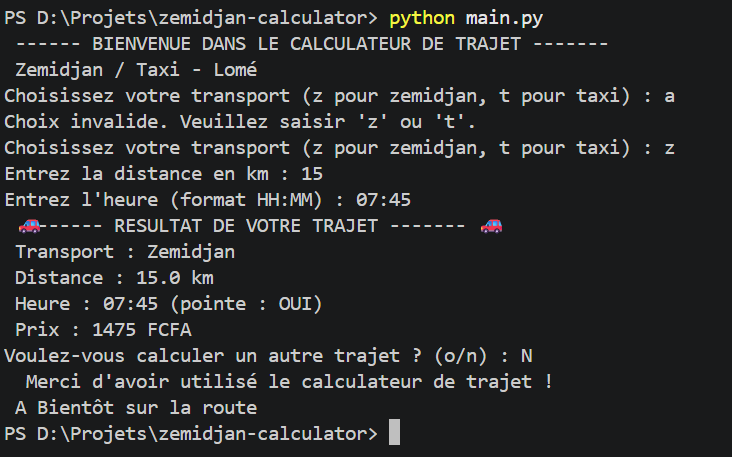

### Structure du projet

- constantes.py : les tarifs et plages horaires
- calculateur.py : fonction de  conversion et calcule
- interface.py : interface avec l'utilisateur
- main.py : point d'entrée et boucle principale

### Utilisation 

- cloner le projet:
- git clone https://github.com/Abou-fatima/30-Days-Of-Python

Exigence: 
- avoir installé python
- Lancer dans le terminal du projet
python main.py

## 🧪 Résultats des tests

